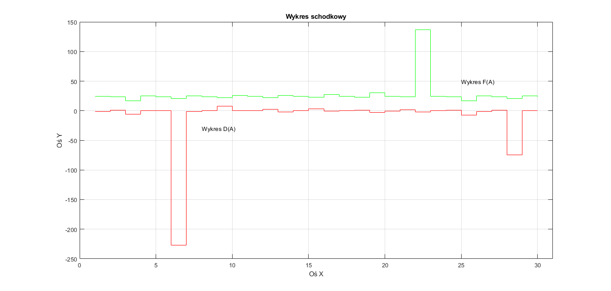

# Grafika 2D

### Pobieramy dane z pliku dane.xls i generujemy:

1. Wykresy kolumn D, E, F w zależności od kolumny A:

2. Wykres schodkowy kolumn D, F w zależności od kolumny A:

3. Wykres słupkowy kolumn D, E, F w zależności od kolumny A:

4. Generujemy nastepujące wykresy na jednym rysunku
- wykres w formie próbek kolumn D, F w zależności od kolumny A
- wykres słupkowy kolumn D, E, F w zależności od kolumny A
- wykres liniowy (znaczniki nie połączone linią) kolumny D od kolumny A
- wykres liniowy kolumny F od A z pogrubioną linią, bez znaczników

