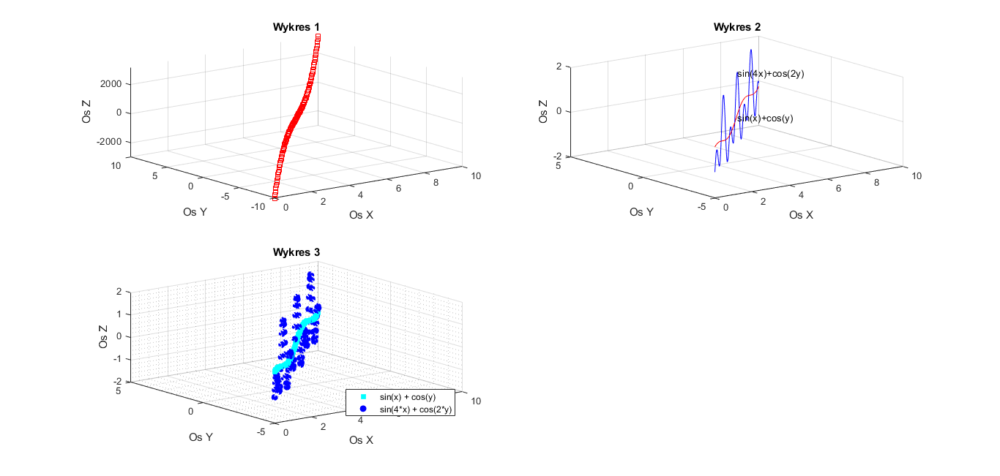
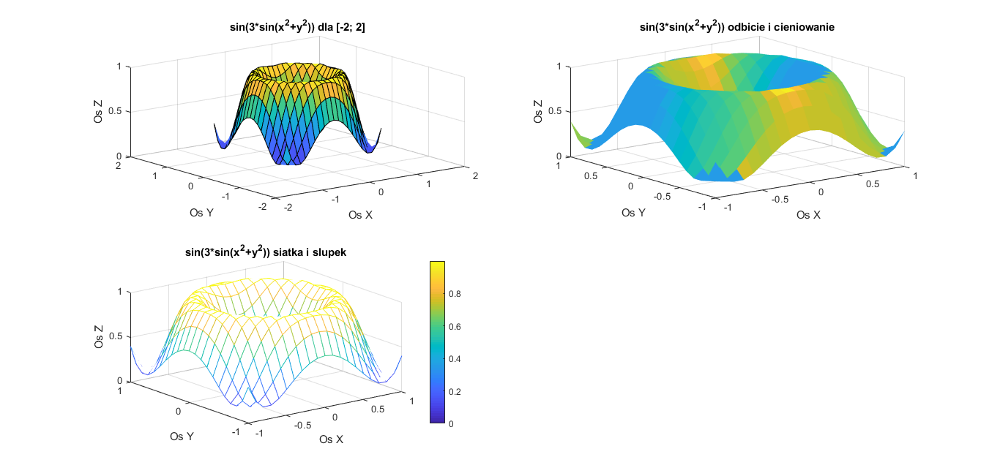

# Grafika 3D

1. Generujemy rysunek z 3-ema wykresami:
- Wykres funkcji f(x,y) = 2*x2 + 3*y3
- Wykresy funkcji f(x,y) = sin(x) + cos(y) i f(x,y) = sin(4x) + cos(2y)
- Wykresy funkcji j.w. ale krzywe zlozone z wypelnionych znacznikow

2. Generujemy rysunek z 3-ema wykresami f(x,y)=sin(3*sin(x2 + y2)) dla wartości x i y z zakresu od -1 do 1
- w formie kolorowej powierzchni, dla osi x i y sformatowanych w zakresie od -2 do 2
- kolorowa powierzchnia z uwzglednieniem odbicia swiatla i efektem cieniowania
- w formie siatki, ze slupkiem palety barw

