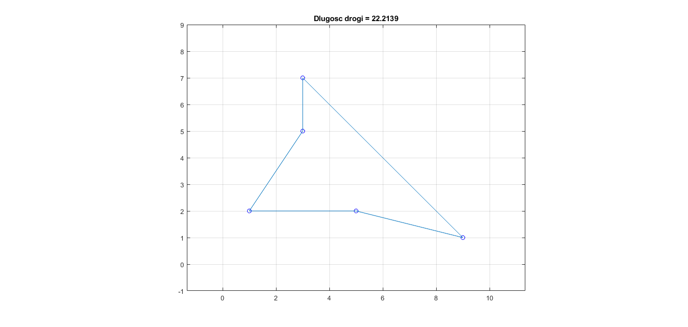

# Problem komiwojażera

TSP – Travelling Salesman Problem, polegający na znalenieniu cyklu w grafie o najmniejszej sumie wag krawędzi (odległości między punktami). Tak sformułowane zadanie stanowi „Problem NP-zupełny”, ale istnieją algorytmy optymalizacyjne, które potrafią podać poprawne (bądź zbliżone do poprawnego) rozwiązanie w czasie wielomianowym.

## Metoda najbliższego sąsiada – nearest neighbor

- Wybieramy punkt początkowy, następnie przechodzimy z niego do tego punktu, który jest najbliżej - zapisując go na liście odwiedzonych
- Z każdego kolejnego punktu przechodzimy do najbliższego, który jeszcze nie został odwiedzony
- Całą procedurę powtarzamy dla każdego punktu jako punktu początkowego
- Najlepsze spośród rozwiązań dla każdego z miast jako początkowego jest wynikiem działania całego algorytmu

Stosując tę zasadę liczymy na to, iż wykonując najlepsze wybory na poziomie lokalnym, otrzymane rozwiązanie będzie dobrej jakości. Takie podejście często daje wyniki dalekie od optymalnego, jednak ze względu na swoją szybkość może służyć jako pierwszy krok przed wykorzystaniem bardziej zaawansowanych heurystyk. Metoda jest procedurą deterministyczną, tzn. za każdym razem da ten sam wynik.

> komiwojazer_najblizszy_sasiad.m

Algorytm znalazł optymalną ścieżkę.

## Algorytm 2-optymalny

Jest to metoda heurystyczna. Obserwacja: krzyżujące się połączenia między miastami najczęściej są gorsze niż takie, które się nie krzyżują. 

- W algorytmie 2-optymalnym sprawdzamy wszystkie możliwe pary krawędzi i jeśli którakolwiek zawiera krawędzie krzyżujące się, następuje takie przestawienie czterech miast na trasie, by krzyżujące się krawędzie zostały zastąpione przez takie, które się nie krzyżują.
- Brak krzyżujących się krawędzi wcale nie gwarantuje optymalności rozwiązania i cały proces przeważnie kończy się w minimum lokalnym. 
- Aby "uciec" z tego minimum lokalnego wprowadzić można losowe zaburzenia do aktualnie najlepszej trasy (Disturbance after each trial), poprzez losowe przestawienie miast na trasie (2 cities switch), bez względu na to czy poprawia to rozwiązanie czy też nie
- Po takim losowym zaburzeniu następuje ponowna próba usunięcia krzyżujących się krawędzi
- Cała procedura jest powtarzana przez zadaną liczbę iteracji bądź też dopóki prowadzi do poprawy rozwiązania

> komiwojazer_tsp.m

W programie istnieje możliwość ustawienia liczby losowych zaburzeń jak również liczby powtórzeń całej procedury. 

Algorytm zwraca trasę oraz długość ścieżki. Funkcja na wejściu pobiera macierz współrzędnych o wymiarach Nx2 lub Nx3 lub macierz odległości. Algorytm Euklidesowy do obliczania odległości jest wykorzystywany do liczenia dystansu. M jest liczbą całkowitą posiadającą wartość od 1 do N (domyślnie M = 1).