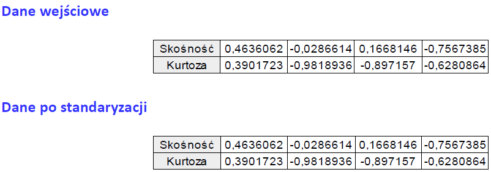
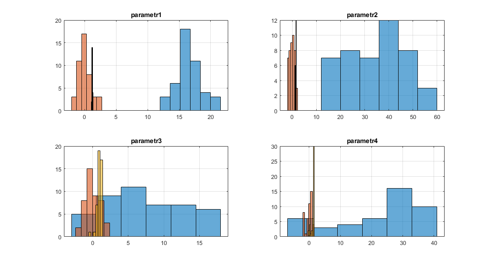

# Normalizacja

1. W pliku dane.xls znajdują się dane opisujące pewne próbki. Każda próbka jest opisana czterema parametrami. Normalizujemy dane (parametry opisujące próbki) do następujących zakresów: [0 1]; [1 5]; [-1 1].

> Plik normalizacja.xls

- Tabelka Normalizacja [0 1] (komórki G3 : J47)
- Tabelka Normalizacja [1 5] (komórki V3 : Y47)
- Tabelka Normalizacja [-1 1] (komórki AA3 : AD47)

2. Rysujemy histogramy dla wszystkich czterech parametrów (dane nieznormalizowane)

3. Wykonujemy standaryzację danych dla wszystkich czterech parametrów opisujących próbki. Obliczamy średnie i odchylenia standardowe dla danych po standaryzacji. 

> Plik normalizacja.xls
- Tabelka Standaryzacja (komórki Q3 : T47)

Standaryzacja to rodzaj normalizacji, dzięki któremu otrzymujemy zbiór danych, których wartość średnia wynosi 0, a odchylenie standardowe 1. Dzięki temu wszystkie cechy mają jednakowy wkład do wartości odległości.

Dzięki ustandaryzowaniu różnych parametrów możemy określić jak bardzo wynik różni się od średniej wartości w populacji. Po przekształceniu możemy porównać wartości, które przed standaryzacją nie były ze sobą porównywalne.

4. Obliczamy wartości skośności i kurtozy dla parametrów przed i po standaryzacji. 

Wniosek: standaryzacja danych nie ma wpływu na skośność i kurtozę (proprorcje między parametrami są zachowane, zmieniają się jedynie parametry).

5. Rysujemy wykresy przedstawiające histogramy dla danych przed i po standaryzacji. Wykresy wykonujemy dla wszystkich czterech parametrów.

Standaryzacja spowodowała zawężenie histogramu (dane po standaryzacji przyjmują wartości z mniejszych przedziałów niż wartości oryginalne), przez co występuje mniejsze odchylenie standardowe. 

Wzorzec symetrii pozostaje ten sam. Wykresy po standaryzacji zachowują swoją skośność w porównaniu do danych wejściowych. Po standaryzacji histogramy są przesunięte do wartości zerowych (po standaryzacji średnia arytmetyczna wynosi 0).

6. Wykonujemy przekształcenie logarytmiczne danych dla wszystkich czterech parametrów opisujących próbki.

> Plik normalizacja.xls
- Tabelka log(x) (komórki AK3 : AN47)

7. Liczymy wartości skośności i kurtozy dla parametrów przed i po przekształceniu logarytmicznym.

Przekstałcenie logarytmiczne zmienia wartości skośności i kurtozy.

8. Rysujemy wykresy przedstawiające histogramy dla danych surowych, po standaryzacji i po przekształceniu logarytmicznym, dla wszystkich czterech parametrów.

Przekształcenie lograrytmiczne spowodowało jeszcze wieksze zawężenie histogramu w porównaniu do standaryzacji (dane przyjmują wartości z mniejszych przedziałów niż wartości oryginalne), przez co również występuje mniejsze odchylenie standardowe. Wzorzec symetrii pozostaje ten sam. Wykresy po przekształceniu logarytmicznym nie zachowują swojej skośności i kurtozy w porównaniu do danych wejściowych. Po przekształceniu logarytmicznym histogramy (podobnie jak po standaryzacji) są przesunięte do wartości zerowych.

