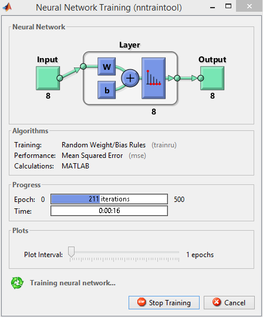
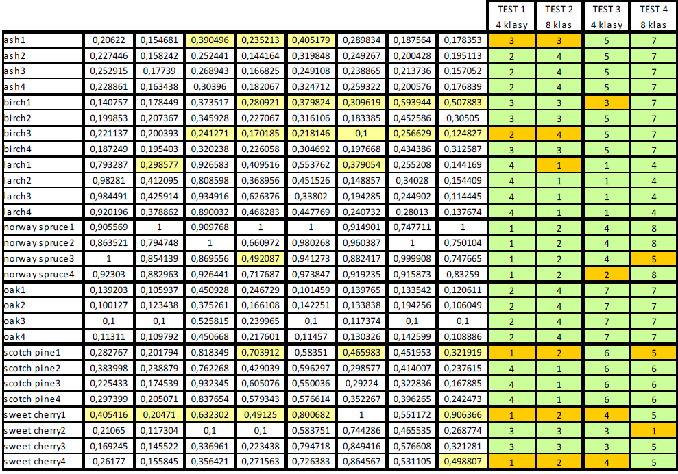

# Sieć neuronowa Kohonena - analiza skupień

- W pliku analiza_skupien.xls znajdują się dane opisujące parametry drewna. 
- W kolumnie A znajdują się nazwy próbek opisane nazwą gatunki drewna i liczbą np. ash1, ash2, ash3 i ash4.
- Każda z próbek jest opisana przez 8 parametrów. Dane zostały znormalizowane.

Sprawdzamy jak sieć Kohonena pogrupuje próbki. Czy próbki drewna tego samego gatunku zostały przyporządkowane do tej samej klasy?

Sieć uczymy zbiorem danych zawartym w pliku analiza_skupien.xls i testujemy tym samym zbiorem.

> Plik siec_neuronowa.m

Sprawdzamy przyporządkowanie gatunków drewna przy podziale na 4 i 8 klas. Dla zwiększenia dokładności sieć trenujemy na 500 epokach.

Dla lepszej interpretacji wyników przeprowadzono po 2 testy dla 4 i 8 klas.

> Wynik Plik siec_neuronowa.xls

- W większości przypadków próbki drewna tego samego gatunku zostały przyporządkowane do wspólnej klasy
- W tabeli zaobserwować można zależność pomiarów parametrów, których wartość odbiega od średniej dla danego pomairu (kolor jasnożółty) w ramach jednego gatunku od wyjątków
przyporządkowania danego gatunku do poszczególnej klasy (kolor ciemnożółty).