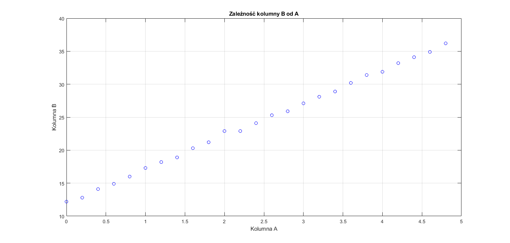

# Statystyka

1. Pobieramy dane zapisane w pliku dane.xls i zapisujemy do macierzy A

2. Liczymy dla kazdej kolumny macierzy A
- średnią arytmetyczną, medianę, kwantyl pierwszy i trzeci
- wariancję, odchylenie standardowe, skośność, kurtozę

3. Zależność drugiej i trzeciej kolumny macierzy A od kolumny pierwszej na odrębnych wykresach punktowych

4. Współczynniki korelacji liniowej Pearsona dla danych z poszczególnych kolumn macierzy A

5. Regresja liniowa dla danych z kolumny pierwszej i drugiej macierzy A
- dane oryginalne w formie wykresu punktowego i linię regresji
- wykres błędu przybliżenia

6. Aproksymacja wielomianem 2 i 3 rzędu dla danych z kolumny pierwszej i trzeciej macierzy A
- dane oryginalne w formie wykresu punktowego i krzywe przybliżające
- wykres błędu przybliżenia wielomianem 2 i 3 rzędu

