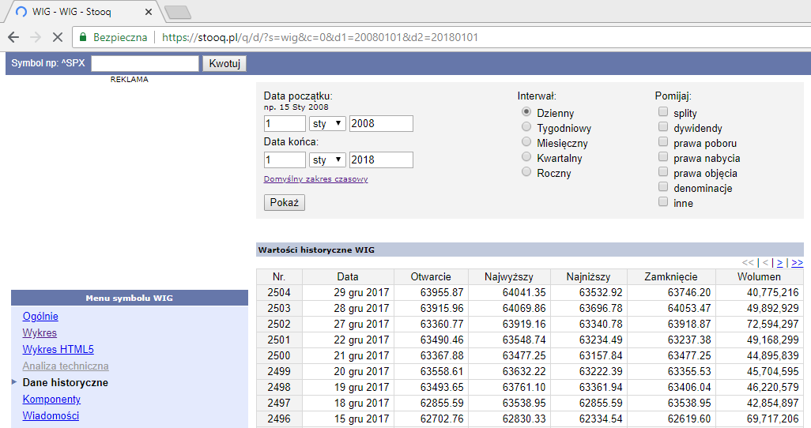

# Szeregi czasowe

1. Szereg finansowy pobrany ze strony https://stooq.pl (symbol "WIG", zakładka "Dane historyczne"). Eksport do formatu .csv i konwercja do .xls

> Plik szeregi_czasowe.xls

Tabela odpowiednio sformatowana z podziałem na lata:

2. Liczymy średnie roczne wartości notowań wraz z odchyleniami standardowymi. Wyniki przedstawiamy na wykresie (na osi x - numer roku, na osi y – średnią). Prowadzimy
prostą regresji (wyznaczamy równanie tej prostej) dla uzyskanych punktów.

> Plik szeregi_czasowe.m
- W pliku dane z .XLS imporotwane są do macierzy WIG
- Następnie tworzony jest wektor pomocniczy z latami (wektor x) a także średnią arytmetyczną wartości notowań dla poszczególnych lat (wektotr y)
- Następnie rysujemy wykres punktowy oraz prostą regresji:

- Współczynnik regresji liniowej wynosi 0.0022 (wartość b dla równania liniowego y = ax + b wynosi -4.4030). Oznacza to, że dane można przybliżyć f-cją y = 0,0022x – 4,4030
- Ponieważ a > 0 oraz na podstawie obserwacji wykresu można wyciągnąć wniosek, że w całkowitej perspektywie (choć w poszczególnych latach występują wartości mniejsze od
poprzednich) wraz ze wzrostem argumentów w kolejnych latach spodziewamy się wzrostu wartości (indeksu średniego dla danego roku)

3. Generujemy wykresy pudełkowe dla danych z kolejnych lat (na jednym wykresie).

> Plik szeregi_czasowe.m

- Największe rozproszenie (wahania indeksu giełdowego, w tym odległość min/max od mediany) można zaobserwować w latach 2008 i 2009
- W latach 2010, 2012, 2014 i 2016 wykres jest względnie symetryczny
- W latach 2013 obserwujemy asymetrię prawostronną
- W latach 2011 i 2017 obserwujemy asymetrię lewostronną
- W latach 2009, 2012, i 2016 mediana jest mniejsza niż w roku poprzedzającym (spadek notowań)

4. Przedstawiamy na wykresach wyniki notowań z dowolnych pięciu lat (na osi x - numer dnia, na osi y – wartość notowania).

> Plik szeregi_czasowe.m

Średnia liczba notowań na giełdzie wynosi 252 dni, jest różna w poszczególnych latach w zależności od rozkładu weekendów, świąt oraz dni wolnych od pracy.

- W ujęciu globalnych wpływy sezonowe raczej trudno jest zaobserwować
- Można pokusić sie o stwierdzenie, że w ostatnich 3 latach notowania w 1. kwartale roku mają tendencję raczej wzrostową a w latach 2013-2015 w 3. kwartale zaobserwować można tendencje spadkowe